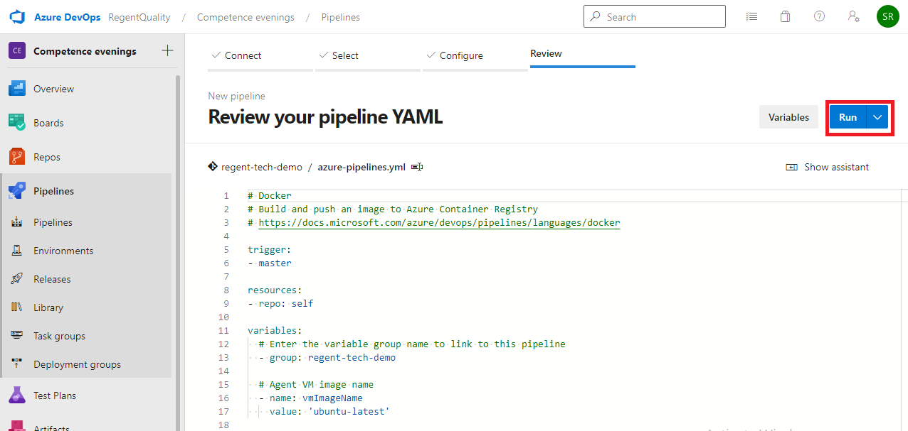

# Deploying a Node.js API and Mysql Docker images to Multicontainer app in Azure App Services through CI/CD

## Overview

A Docker container image is a lightweight, standalone, executable package of software that includes everything needed to run an application: code, runtime, system tools, system libraries and settings.

This lab outlines the process to build custom Docker image of a [**Node.js**](https://docs.docker.com/language/nodejs/) application, push the image to a private repository in [Azure Container Registry](https://azure.microsoft.com/en-in/services/container-registry/) (ACR). These images will be used to deploy a multicontainer app in the **Azure App Service** (Linux) using Azure DevOps.

The Web App for Containers allows the creation of custom [Docker](https://www.docker.com/what-docker) container images, easily deploy and then run them on Azure. Combination of Azure DevOps and Azure integration with Docker will enable the following:

1. Build a custom Docker image.

1. Push and store the Docker images in a private repository.

1. Deploy and run the images on Azure App Services.

## Setting up the Environment

1. The following resources needs to be configured for this lab:

   * Azure Container Registry

   * Azure Web App for Containers

2. **Create Azure Container Registry:**
    
    1. Select **+Create a resource** in the Azure Portal and search for Container Registry. Select Subscription, Resource Group, Location, SKU. Replace `<Registry name>` with the name of your choosing. Select **Review + create**.
        
       

   > **Note:-**
   > Enter a unique ACR name. ACR name may contain alpha numeric characters only and must be between 5 and 50 characters.
        
    2. Click **Create**.

       

    3. Navigate back to the resource group. Click on the container registry and enable the Admin user for the registry. This is to allow Azure DevOps to push and read images from ACR. Make a note of the **Registry name**, **Login server**, **username**, **password**. These details will be required in the Exercise 1 and Exercise 2.

       

3. **Create Azure Web App for Containers**:
   
   1. Select **+Create a resource** in the Azure Portal and search for Web App for Containers. Select Subscription, Resource Group, Name, Operating System, Region, Pricing Plan. Replace `<Name>` with the name of your choosing. Click **Next**.
      
      

   > **Note:-**
   > Enter a unique Azure Web App Name.

   2. Select Docker Compose (Preview) Option, Image Source, Registry and click **Review+create**.

      

   3. Click **Create**.

      

## Exercise 1: Configure Continuous Integration (CI)

Now that the required resources are provisioned, the **Build** and the **Release** Pipelines needs to created.

1. Navigate to the [Azure DevOps](https://dev.azure.com/RegentQuality/) and select the **Competence evenings** project.

   
   
1. Select **Repos** and click **import** to import a new repository.

   

1. Select Repository type as **Git** and enter the Clone URL as `https://github.com/srinathreddy4/regent-tech-demo`. Select Import.

   

1. Select **Library** under the Pipelines.

   

1. Select **+variable group** to create a new variable group.

   

1. Enter the variable group name and below variables. Click on the **Save** button.

   

1. Select **Project settings** at the bottom left.

   

1. Select Service Connections and select **New service connection**.

   

1. Select Docker Registry.

   

1. Enter the details which you noted down earlier and click **save**.

   

1. select pipelines and click **New pipeline** to create a Build pipeline.

   

1. select **Azure repos Git**.

   

1. select **regent-tech-demo** repo.

   

1. select **Existing Azure Pipelines YAML file**.

   

1. select master branch and yaml file path. Click **Continue**.

   

1. Click **Run** to run the Build Pipeline.

   

1. The Build will generate and push the docker image of the web application to the Azure Container Registry. Once the build is completed, the build summary will be displayed.

   

## Exercise 2: Configure Continuous Delivery (CD)

1. Navigate to the Azure Portal and click on the App Service that was created at the beginning of this lab. Select the Container Settings option and provide the information as suggested and then click the Save button.

   

1. Navigate back to the Azure Portal and click on the Overview section of the App Service. Click on the link displayed under the URL field to browse the application and view the changes.

   

1. Select **Library** under the Pipelines.

   

1. Select **Library** under the Pipelines.

   

1. Select **Library** under the Pipelines.

   

1. Select **Library** under the Pipelines.

   

1. Select **Library** under the Pipelines.

   

1. Select **Library** under the Pipelines.

   

1. Select **Library** under the Pipelines.

   

1. Select **Library** under the Pipelines.

   

## Summary

With **Azure DevOps** and **Azure**, we have configured a Build and Release pipeline to deploy a Node.js API and Mysql database on Azure App Services.
